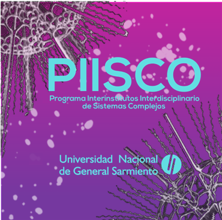
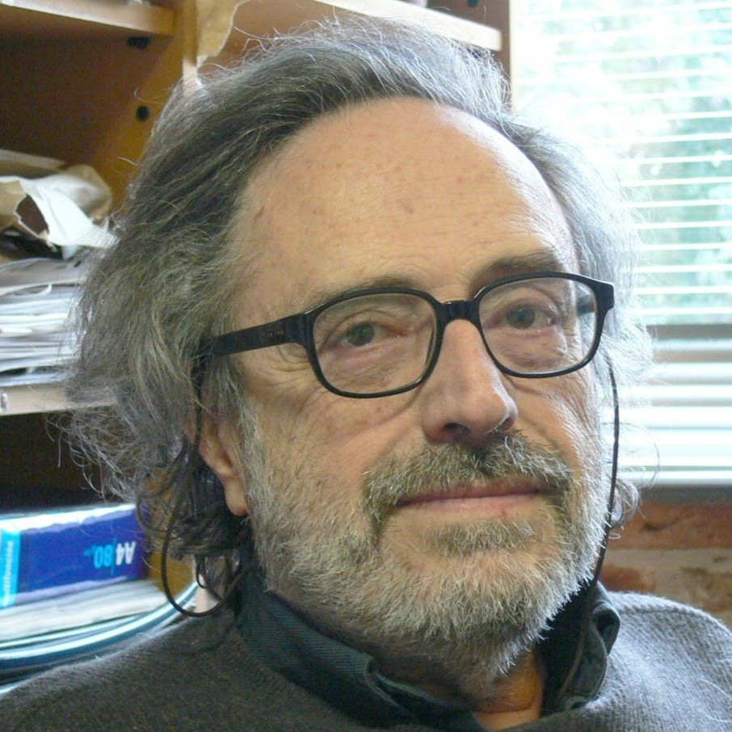

```{r setup, include=FALSE}
knitr::opts_chunk$set(echo = FALSE)

# Learn more about creating websites with Distill at:
# https://rstudio.github.io/distill/website.html

```

# From ecosystems to society and epidemics 

:::: {style="display: grid; grid-template-columns: 180px auto; grid-column-gap: 10px;"}

::: {}



:::

::: {}
Complex systems as interdependent units, which present adaptive behaviors and emerging dynamics are today on everyone's lips, epidemics, fires, climate change, the loss of biodiversity, all of them resulting from complex interactions and feedbacks that have the possibility of changing the balance of the earth as a whole. These extensive and varied networks of interactions that connect different and distant parts are the reason for this workshop: different approaches and different topics that come together in the study of complex systems.


<a href="https://twitter.com/intent/tweet?screen_name=ecomplex_lab&ref_src=twsrc%5Etfw" class="twitter-mention-button" data-show-count="false">Tweet to @ecomplex_lab</a><script async src="https://platform.twitter.com/widgets.js" charset="utf-8"></script>

:::

::::

---

# PIISCO history  

:::: {style="display: grid; grid-template-columns: 180px auto; grid-column-gap: 10px;"}

::: {}



:::

::: {}

The Complex systems group of the University of General Sarmiento (PIISCO) was created by [Miguel Virasoro](https://es.wikipedia.org/wiki/Miguel_%C3%81ngel_Virasoro), a pioneer of string-theory and former director of the International Centre for Theoretical Physics [ICTP](https://www.ictp.it/), in 2020 he was awarded the [Dirac Medal of the ICTP](https://www.ictp.it/about-ictp/prizes-awards/the-dirac-medal.aspx).

:::

::::

---


# De los ecosistemas a la sociedad y las epidemias

:::: {style="display: grid; grid-template-columns: auto 180px; grid-column-gap: 10px;"}


::: {}

Los sistemas complejos como unidades interdependientes, que presentan comportamientos adaptativos y dinámicas emergentes están hoy en dia en la boca de todos, las epidemias, los fuegos, el cambio climático, la perdida de la biodiversidad todos ellos resultantes de complejas interacciones y retroalimentaciones que tienen la posibildad de cambiar el equilibrio de la tierra como un todo. Estas extensas y variadas redes de interacciones que conectan distintas y lejanas partes son el motivo de este workshop: diferentes aproximaciones y distintos temas que confluyen en el estudio de los sistemas complejos.

<a href="https://twitter.com/intent/tweet?screen_name=ecomplex_lab&ref_src=twsrc%5Etfw" class="twitter-mention-button" data-show-count="false">Tweet to @ecomplex_lab</a><script async src="https://platform.twitter.com/widgets.js" charset="utf-8"></script>

:::

::: {}


:::

::::

# Registration

- The talks will be broadcast live on our [Youtube channel](https://www.youtube.com/channel/UC-Ww0kQ1Ybnd7wETDA9BxMQ), but a limited number of participants may join by google [Meet](https://meet.google.com/) video-conferencing, the interested ones have to fill the following form

<iframe src="https://docs.google.com/forms/d/e/1FAIpQLScb-Iho5rz54BqWLAR3tjyXGSZUb_5hAWp50uu4wpaGVuqfhQ/viewform?embedded=true" width="640" height="1306" frameborder="0" marginheight="0" marginwidth="0">Cargando…</iframe>


# Day 1 - December 9

-  [Plant-pollination networks, competitive and high dimensionality communities, and adaptive metabolic strategies](dia1.html) 

# Day 2 - December 10 

- [Resilience, Self organization, prediction, economy and Niche Theory](dia2.html) 

# Day 3 - December 11 

- [Earth Bioengineering, carbon cycle, covid19, vector borne diseases and resilience loss](dia3.html) 

# Code of Conduct

- [CDC](cdc.html)

# ECOmplex Collaborators Team {.appendix} 

* Leonardo A. Saravia (PIISCO coordinator) `r icon::fa_twitter()` @larysar

* Iara D. Rodriguez - CONICET UNGS (Graphic design) `r icon::fa_instagram()` @ECOmplex_lab

* Melisa Leyton - UBA IAA (Graphic design)

* Tomas Marina - CONICET CADIC (Organization) `r icon::fa_twitter()` @ECOmplex_lab
